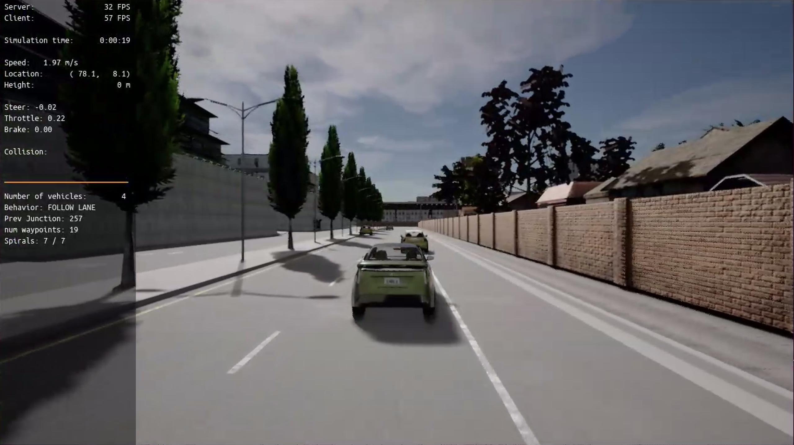
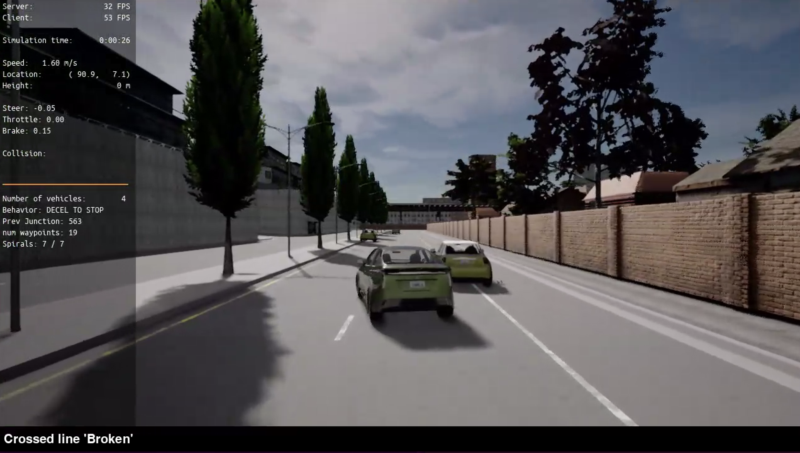
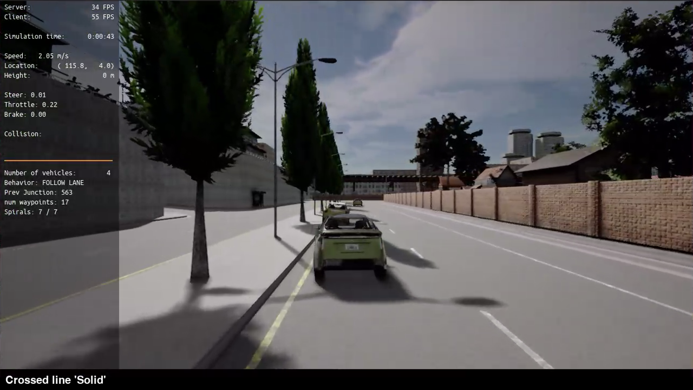
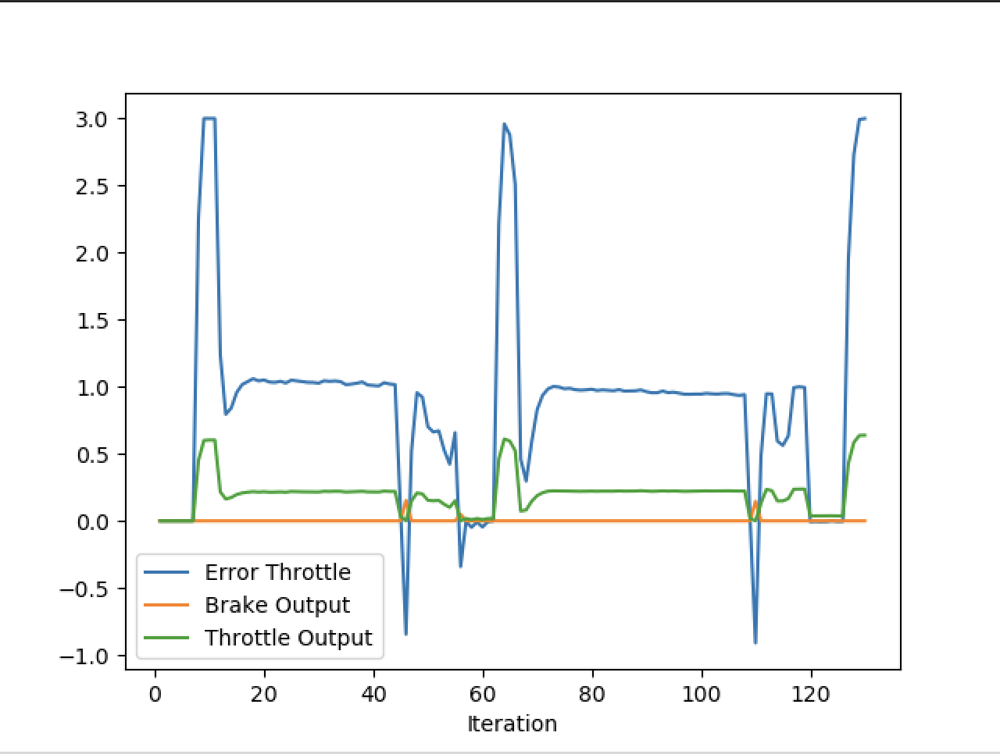
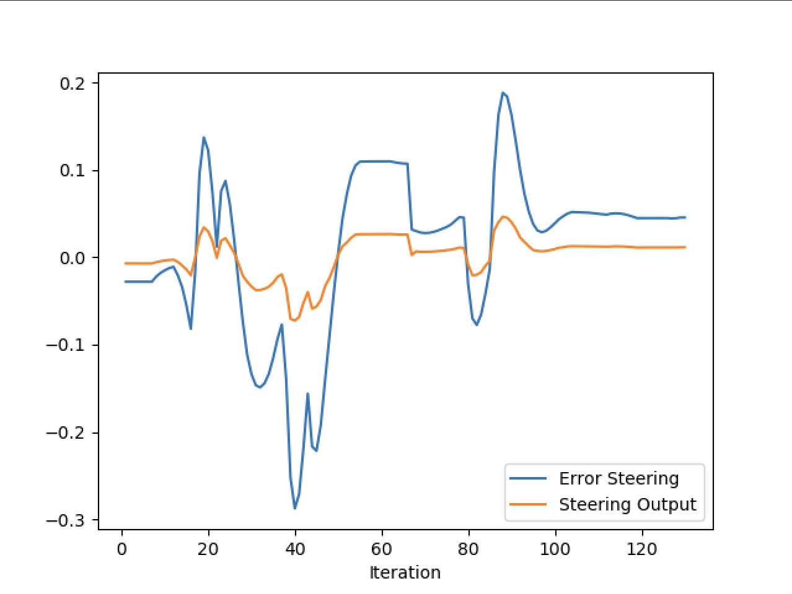
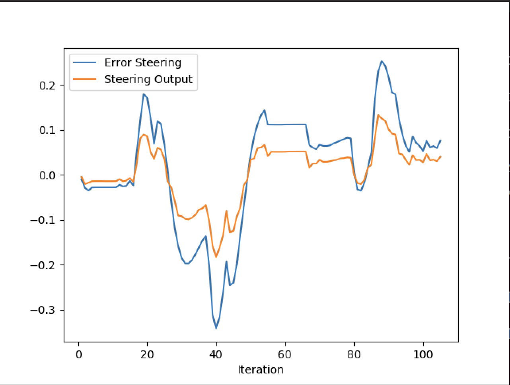

# Control and Trajectory Tracking for Autonomous Vehicle
# Proportional-Integral-Derivative (PID)
In this project, you will apply the skills you have acquired in this course to design a PID controller to perform vehicle trajectory tracking. Given a trajectory as an array of locations, and a simulation environment (the vehicle with possible perturbations), you will design and code a PID controller and test its efficiency on the CARLA simulator used in the industry.

# Project Workflow
# Step 1: Build the PID controller object
Complete the TODO in the pid_controller.h and pid_controller.cpp.

Run the simulator and see in the desktop mode the car in the CARLA simulator. Take a screenshot and add it to your report. The car should not move in the simulation.

# Step 2: PID controller for throttle:
In main.cpp, complete the TODO (step 2) to compute the error for the throttle pid. The error is the speed difference between the actual speed and the desired speed.
Useful variables:

The last point of v_points vector contains the velocity computed by the path planner.
velocity contains the actual velocity.
The output of the controller should be inside [-1, 1].
Comment your code to explain why did you computed the error this way.
Tune the parameters of the pid until you get satisfying results (a perfect trajectory is not expected).
# Step 3: PID controller for steer:
In main.cpp, complete the TODO (step 3) to compute the error for the steer pid. The error is the angle difference between the actual steer and the desired steer to reach the planned position.
Useful variables:

The variable y_points and x_point gives the desired trajectory planned by the path_planner.
yaw gives the actual rotational angle of the car.
The output of the controller should be inside [-1.2, 1.2].
If needed, the position of the car is stored in the variables x_position, y_position and z_position
Comment your code to explain why did you computed the error this way.
Tune the parameters of the pid until you get satisfying results (a perfect trajectory is not expected).
# Step 4: Evaluate the PID efficiency
The values of the error and the pid command are saved in thottle_data.txt and steer_data.txt.

# Project Report

### Plots
Throttle: Kp: 0.2, Ki: 0.001, Kd: 0.02

Steer: Kp: 0.25, Ki: 0.0009, Kd: 0.06

Steer: Kp: 0.5, Ki: 0.005, Kd: 0.3

From the plots we can see that the first steering plot showed a huge difference than the second steering plot. The second steering plot had larger parameters which allowed the car to change steering more aggressively. The peaks represents the obstacles on the road while the car is trying to adjust to them.

### What is the effect of the PID according to the plots, how each part of the PID affects the control command?
The proportional gain (Kp) is the amount of error that the car needs to change to reach its required position. The higher it is the more agressively it will respond to the error and will cause overshooting.

The inegral gain (Ki) is based on the difference of the position to the desired position accumulated over time. A high value will cause the controller to respond more aggressively and can caluse oscillations.

The derivative gain (Kd) is based on the rate of change based from the previous position to the current over time. A high value will cause it to repond aggressivly and can cause overshooting and oscillations.
### How would you design a way to automatically tune the PID parameters?
I would use the Twiddle methods to find the best parameters that would result in the most minimum error.

### PID controller is a model free controller, i.e. it does not use a model of the car. Could you explain the pros and cons of this type of controller?
Pros: It is very easy to understand and implement and can be used in almost all system.
Cons: Can be difficult to tune the parameters.

### What would you do to improve the PID controller?
I would use the Twiddle method to find the best parameters.

